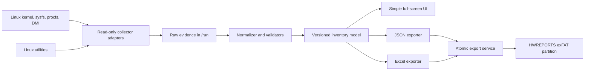

# Bootable USB Hardware Inventory Scanner

## Research and Codex implementation plan

**Status:** build-ready design baseline  
**Last reviewed:** 2026-08-17  
**Initial target:** 64-bit Intel/AMD PCs (`amd64`), Debian 13 “trixie”  
**Working product name:** HWScan USB

## 1. Executive summary

This tool is feasible. A computer can boot a self-contained Linux environment from a USB drive, inventory the hardware without installing Windows or writing to the computer's internal disks, show the result in a simple full-screen interface, and save both `.xlsx` and `.json` reports to a writable partition on that same USB drive.

The recommended first version is:

- Debian 13 stable, built with Debian `live-build`.
- A read-only live operating system with a temporary RAM overlay.
- A separate exFAT partition named `HWREPORTS`, kept readable by Windows and macOS.
- A Python application with a small Tkinter UI.
- Linux's existing hardware tools as collectors; do not reimplement hardware probing.
- A normalized, versioned JSON model as the source of truth.
- Excel generation with `openpyxl`.
- An unprivileged UI and a narrowly scoped privileged collection service.
- No network dependency, no mounting of internal filesystems, and no write operations to detected hardware.

The principal risk is not basic inventory—the Linux kernel, sysfs, SMBIOS, PCI, and storage tools provide that well. The risk is matching every HWiNFO detail. Windows vendor drivers expose some motherboard sensors, embedded-controller data, GPU details, and device-specific metrics that generic Linux drivers do not. The product should therefore report `unknown` or `unsupported`, with a reason, instead of guessing.

## Implementation checkpoint — 2026-08-17

Legend: ✅ completed and verified on the current Mac; 🟡 implemented or scaffolded but still requires Linux/physical validation; ⬜ not started because it requires an `amd64` Linux environment, USB, or target hardware.

| Area | Status | Verified result / remaining gate |
|---|---:|---|
| Personal GitHub repository | ✅ | Public `Donkijote/os-info` repository created; direct commits to `main`; release links added. |
| Python project and development environment | ✅ | Python 3.12 project locked with `uv`; formatting, linting, strict typing, and tests configured. |
| Inventory model and JSON Schema | ✅ | Schema 1.0.0, typed model, normalization, source provenance, and diagnostics implemented. |
| Safe command runner | ✅ | Absolute executable boundary, controlled locale/path, timeouts, process-group termination, output limit, and failure states tested. |
| Fixture-driven collectors | ✅ | Synthetic DMI, CPU, memory, storage/health, GPU, network, battery, and boot data normalize successfully. |
| Real Linux hardware collectors | 🟡 | Command allowlist is scaffolded; actual sysfs/tool execution and vendor fixtures require `amd64` Linux hardware. |
| JSON/Excel/checksum export | ✅ | Matching JSON and Excel reports plus SHA-256 manifest are generated, validated, and atomically finalized. |
| UI application layer | ✅ | View model and fixture-driven Tk development screen pass Mac tests; Linux full-screen integration remains pending. |
| Privacy/safety documentation | ✅ | Privacy contract, source precedence, known limitations, fixture metadata, and release checklist added. |
| Continuous integration | ✅ | GitHub's Linux runner independently passed fixture checks, lint/format, strict typing, and all tests. |
| Debian live image | 🟡 | Debian 13 live-build configuration and package list are committed; build/application packaging/QEMU boot are pending. |
| USB provisioning | ⬜ | Inspection-only script intentionally refuses destructive work until Linux and disposable-USB testing are available. |
| Physical/vendor testing | ⬜ | Requires USB plus Dell/HP/Lenovo/custom target PCs; no hardware compatibility claim yet. |

Current verification: fixture privacy check passed; Ruff formatting/lint passed; mypy strict checking passed for 20 source files; 12 pytest tests passed; sample JSON/XLSX/manifest export passed; Tk window construction passed. GitHub's Linux CI runner independently passed the repository suite. Generated sample reports remain ignored under `build/`.

## 2. Product goal and success criteria

### Goal

Create one reusable USB appliance that an operator can insert into an arbitrary supported PC and use as follows:

1. Select the USB device in the PC's boot menu.
2. Wait for HWScan USB to open automatically.
3. Review or rescan the detected hardware.
4. Optionally enter an asset tag, operator name, and notes.
5. Press **Export report**.
6. Receive matching Excel and JSON files on the USB.
7. Shut down, remove the USB, and open the reports on another computer.

### MVP acceptance criteria

- Boots on representative UEFI PCs from Dell, HP, Lenovo, and a custom desktop.
- Boots without using an installed operating system.
- Does not mount internal partitions and does not write to internal drives.
- Collects system identity, firmware, CPU, memory, graphics, storage, network, battery, and boot-security data where the hardware exposes them.
- Finishes a normal scan in under 90 seconds; a slow or broken device may time out without blocking the entire scan.
- Clearly distinguishes `ok`, `unknown`, `unsupported`, `permission_denied`, `timed_out`, and `parse_error` results.
- Shows a readable summary and collection warnings in the UI.
- Writes a valid `.xlsx`, a schema-valid `.json`, and a SHA-256 manifest to `HWREPORTS`.
- The report remains present after shutdown and can be read on a current Windows PC.
- If export fails, no half-written report is presented as complete.
- The build records the scanner version, image build ID, kernel, package manifest, and report schema version.

### Explicit non-goals for the first release

- Installing or repairing an operating system.
- Benchmarking or stress-testing hardware.
- Automatically updating firmware.
- Running SMART self-tests or issuing commands that modify storage devices.
- Mounting, decrypting, or inspecting files on internal disks.
- Perfect parity with HWiNFO sensors and Windows-only vendor drivers.
- Supporting 32-bit-only x86 computers, Apple Silicon Macs, Chromebooks, or every ARM PC with the initial `amd64` image.

## 3. Recommended architecture



### Component boundaries

1. **Command runner**
   - Executes an allowlisted command as an argument array, never through a shell.
   - Forces `LC_ALL=C` and a deterministic `PATH`.
   - Applies a per-command timeout.
   - Captures exit code, duration, standard output, and a bounded standard-error excerpt.
   - Never logs report contents or identifiers unless diagnostic export is explicitly enabled.

2. **Collector adapters**
   - One adapter per source or domain: DMI, CPU, PCI, memory, block devices, SMART/NVMe, network, battery, display, sensors, TPM, and boot state.
   - Prefer native JSON or sysfs files. Use stable machine-readable text only when JSON is unavailable.
   - Return typed raw results and diagnostics; collectors do not create UI or report fields.

3. **Normalizer**
   - Merges overlapping sources using documented precedence.
   - Converts capacities to integer bytes, speeds to integer Hz or MT/s, timestamps to RFC 3339 UTC, and IDs to normalized strings.
   - Preserves missing values as `null` and records why they are missing.
   - Computes derived values only when the inputs and formula are defensible.

4. **Application service**
   - Coordinates a scan, publishes progress, validates the normalized model, and hands one immutable snapshot to every exporter.
   - Ensures Excel and JSON describe the same scan and share a `report_id`.

5. **UI**
   - Runs as the unprivileged live user.
   - Invokes only a fixed privileged collection entry point.
   - Presents summary, warnings, editable operator fields, export status, rescan, and shutdown.

6. **Export service**
   - Locates the `HWREPORTS` partition that belongs to the same physical USB as the live system.
   - Writes temporary files, flushes them, validates them, then renames them atomically.
   - Generates checksums and reports available space and write errors clearly.

### Privilege design

Some tools return partial information unless run as root. Do not run the whole graphical application as root. Use this MVP split:

- `/usr/libexec/hwscan-collect`: root-owned, not writable by the live user, and accepts no arbitrary executable or output path.
- `hwscan-collect.service`: a hardened systemd oneshot service that writes only to `/run/hwscan/`.
- A narrowly scoped polkit rule permits the fixed live user to restart that one service.
- The UI reads the resulting normalized snapshot from `/run/hwscan/current.json`.

The service should use systemd hardening where compatible with hardware access: `NoNewPrivileges=yes`, `PrivateTmp=yes`, `ProtectHome=yes`, `ProtectSystem=strict`, a writable `RuntimeDirectory=hwscan`, a capability/device policy limited to what the collectors actually require, and a global timeout. Validate each hardening option on real machines; overly strict device isolation can hide the hardware being scanned.

## 4. Recommended stack

| Layer | Recommendation | Reason |
|---|---|---|
| Base OS | Debian 13 stable (`trixie`), `amd64` | Stable, long support window, broad PC hardware support, and official live-image tooling. |
| Image builder | `live-build` with a repository-owned configuration | Builds a customized live system from package lists, includes, and hooks. |
| Init and autostart | systemd plus a lightweight X session | Reliable service ordering and simple appliance behavior. |
| Desktop/UI | Python 3 + Tkinter, full-screen | Offline, small dependency footprint, simple to test, adequate for this UI. |
| Data model | Python dataclasses plus JSON Schema | Keeps the model explicit and the exported contract language-neutral. |
| Excel output | `openpyxl` | Creates `.xlsx` workbooks offline and supports styles, tables, freeze panes, and validation. |
| Unit/integration tests | `pytest`, fixture files, JSON Schema validation | Separates parsing correctness from access to physical machines. |
| Boot tests | QEMU with SeaBIOS and OVMF | Covers legacy BIOS and UEFI in automation. |
| Release integrity | SHA-256 checksums, package manifest, build metadata | Makes images and reports traceable. |

Use Debian packages wherever possible. Avoid a runtime dependency on PyPI or the internet. If a Python dependency is not in Debian stable, vendor a reviewed wheel with its license and hash or replace it with standard-library code.

### Linux data sources

| Domain | Primary source | Secondary/fallback source | Notes |
|---|---|---|---|
| System, board, BIOS, chassis | `/sys/devices/virtual/dmi/id/*` and `dmidecode` | `lshw -json` | Firmware-supplied DMI values can be blank, generic, duplicated, or wrong. |
| CPU | `lscpu --json` and sysfs | `/proc/cpuinfo` | Normalize sockets, physical cores, logical CPUs, model, architecture, and flags. Current frequency is not a stable rated-speed value. |
| Memory total | `/proc/meminfo`, `sysinfo` | `lshw` | Installed RAM and currently usable RAM are different fields. |
| Memory modules | `dmidecode --type 16,17` | `lshw -class memory -json` | Empty slots and firmware placeholders must not become installed modules. |
| PCI devices and GPU | `lspci -Dmmnnk` | `lshw -class display -json` | Keep numeric vendor/device IDs as well as names. Dedicated VRAM may be unavailable without a vendor driver. |
| Block topology | `lsblk --json --bytes` with an explicit column list | udev/sysfs | Never rely on `lsblk`'s changing default columns. Never mount these filesystems. |
| ATA/SATA/SAS health | `smartctl --scan-open --json` then read-only `smartctl -x --json` | controller-specific warning | Handle USB bridges and RAID controllers as partial/unsupported. Do not start tests. |
| NVMe | `nvme list -o json`, `nvme smart-log -o json` | `smartctl -x --json` | Report NVMe `percentage_used` and available spare directly; label any remaining-life value as an estimate. |
| Network | `ip -json link`, sysfs, PCI/USB IDs | `lshw -class network -json` | Include permanent MAC only when available; mark it as sensitive. Do not connect to a network. |
| Battery | UPower and `/sys/class/power_supply` | DMI type 22 | Compute health only if design and full-charge capacities use compatible units. |
| Displays | DRM sysfs EDID plus `edid-decode` | `xrandr --props` | An attached monitor may not expose EDID through an adapter or dock. |
| Audio/USB | PCI IDs, `lsusb`, ALSA device list | `lshw` | Avoid a huge unfiltered `lsusb -v` in normal reports. |
| Temperatures/fans | `sensors -j` from already loaded drivers | hwmon sysfs | Treat as optional. Do not run invasive auto-detection during a normal scan. |
| TPM | `/sys/class/tpm`, `tpm2_getcap properties-fixed` | device presence only | Access may be blocked by firmware. Do not clear or provision the TPM. |
| Boot state | `/sys/firmware/efi`, `mokutil --sb-state` | EFI variables | Report UEFI versus legacy and Secure Boot separately. |

`lshw` is valuable as a broad fallback and cross-check, not as the only source. Its documentation notes that root is required for complete data and that some architectures and device types are incomplete. `dmidecode` explicitly warns that DMI is firmware-supplied and may be unreliable. Those warnings should shape the product: preserve provenance and never invent a value.

## 5. USB partition and filesystem layout

### Recommended production layout

Use GPT and create partitions in this order so the user-facing data partition is first:

| No. | Name/label | Suggested size | Filesystem/type | Purpose |
|---:|---|---:|---|---|
| 1 | `HWREPORTS` | Remaining capacity | exFAT / Microsoft basic data | Excel, JSON, checksums, optional diagnostics; readable by current Windows and macOS. |
| 2 | `HWBOOT` | 512 MiB | FAT32 / EFI System Partition | UEFI bootloader, kernel, initramfs, and boot configuration. |
| 3 | `HWSYSTEM` | 4–6 GiB | ext4, normally mounted read-only | SquashFS/live payload and immutable application assets. |
| 4 | `BIOSBOOT` | 2 MiB | BIOS boot partition, no filesystem | GRUB core image for legacy BIOS boot on GPT. |

Recommended USB size: **16 GB or larger**. Fast, reputable USB 3.x media matters more than very high capacity.

### Why a separate reports partition

- The live root remains disposable and read-only.
- Report writes cannot casually overwrite boot files.
- exFAT is convenient for moving reports back to Windows.
- The operator can delete/archive reports without changing the scanner OS.
- Image updates can preserve partition 1 if the updater is explicitly designed to replace only the boot/system partitions.

### Provisioning implications

A fixed raw image cannot safely use the remaining capacity of every nominally “16 GB” USB because real device sizes vary. The first release should therefore provide a **Linux provisioning script** that receives an explicit whole-device path, inspects it, displays the exact vendor/model/size, requires a typed confirmation, partitions it, copies the live payload, installs BIOS/UEFI boot files, and verifies the result.

The script must:

- Refuse loop devices unless `--allow-loop` is supplied for tests.
- Refuse the device containing `/`, the build workspace, or the current boot filesystem.
- Refuse a partition path when a whole-disk path is required.
- Refuse devices below the documented minimum size.
- Show all mounted child partitions and stop if any cannot be unmounted cleanly.
- Require `--device /dev/...` and an exact typed confirmation containing the resolved model and size.
- Never infer a target from “the newest removable disk.”
- Verify partition labels, filesystems, GRUB files, and checksums after installation.
- Print a prominent warning that provisioning erases the selected USB.

For a later user-friendly release, add a small cross-platform USB creator or publish a conservative fixed-size image plus a separate expansion utility. Do not make that a prerequisite for proving the scanner.

### Runtime mounts

- The live root uses a RAM overlay; changes disappear at shutdown.
- Mount `HWSYSTEM` read-only.
- Mount `HWREPORTS` at `/media/hwreports` with restrictive options such as `nosuid,nodev,noexec`.
- Do not use label alone if two scanner USBs are attached. Identify the block device backing the live medium, then select its sibling partition with GPT partition name `HWREPORTS`.
- Do not auto-mount internal partitions. Disable the desktop volume manager or omit it entirely.
- Export to `/media/hwreports/reports/<year>/<month>/`.

Suggested filename stem:

```text
2026-08-14T143255Z_DELL-7480_ABC1234_550e8400
```

Sanitize every filename component to ASCII letters, digits, `_`, and `-`; cap lengths; use `UNKNOWN` when absent; and append the first eight characters of `report_id` to prevent collisions.

## 6. Normalized data model

The JSON file is the canonical report. Excel is a presentation of the same model. Version the schema independently from the application using semantic versioning.

### Top-level schema

```json
{
  "schema_version": "1.0.0",
  "report_id": "550e8400-e29b-41d4-a716-446655440000",
  "created_at": "2026-08-14T14:32:55Z",
  "scanner": {
    "app_version": "0.1.0",
    "image_build_id": "2026.08.14.1",
    "os": "Debian GNU/Linux 13",
    "kernel": "...",
    "architecture": "x86_64"
  },
  "operator_input": {
    "asset_tag": null,
    "operator": null,
    "location": null,
    "notes": null
  },
  "boot": {},
  "system": {},
  "cpus": [],
  "memory": {},
  "storage": [],
  "graphics": [],
  "network": [],
  "batteries": [],
  "displays": [],
  "audio": [],
  "usb_devices": [],
  "security": {},
  "sensors": [],
  "diagnostics": [],
  "sources": []
}
```

### Required conventions

- Byte counts are integers ending in `_bytes`; do not label decimal GB values as GiB.
- User-facing Excel may display both decimal GB and binary GiB, with units in the header.
- Times use RFC 3339 UTC. Durations use integer milliseconds or hours as declared by the field name.
- Boolean, numeric, unknown, and empty-string values are distinct. Unknown is JSON `null`, not `"N/A"`.
- Enumerations are lowercase machine values such as `uefi`, `legacy`, `enabled`, `disabled`, `unknown`.
- Serial numbers and MAC addresses remain strings to preserve leading zeroes.
- Every repeated device has a stable scan-local ID, preferably derived from a hardware path plus a collision suffix. Do not claim it is globally stable.
- A `source_ref` links important values to entries in `sources`.
- Derived fields include `calculation`, `inputs`, and `confidence` when ambiguity matters.

### Core objects and fields

#### `boot`

- `mode`: `uefi`, `legacy`, or `unknown`
- `secure_boot`: `enabled`, `disabled`, `unsupported`, or `unknown`
- `live_medium_device`
- `reports_partition_device`

#### `system`

- `manufacturer`, `product_name`, `version`, `family`, `sku`
- `serial_number`, `uuid`, `asset_tag`
- `board.manufacturer`, `board.product`, `board.version`, `board.serial_number`
- `chassis.manufacturer`, `chassis.type`, `chassis.serial_number`
- `firmware.vendor`, `firmware.version`, `firmware.release_date`

#### `cpus[]`

- `socket_id`, `manufacturer`, `model_name`, `architecture`
- `sockets`, `physical_cores`, `logical_cpus`, `threads_per_core`
- `max_mhz`, `min_mhz`, `current_mhz` when exposed
- `virtualization`, `flags`

#### `memory`

- `installed_bytes`, `usable_bytes`, `slots_total`, `slots_populated`
- `modules[]`: locator, bank locator, size bytes, memory type, form factor, configured speed MT/s, rated speed MT/s, manufacturer, part number, serial number, rank, and status

#### `storage[]`

- `id`, `path`, `device_type`, `transport`, `removable`
- `vendor`, `model`, `serial_number`, `firmware_version`, `wwn`
- `capacity_bytes`, `logical_sector_bytes`, `physical_sector_bytes`, `rotational`
- `smart_available`, `smart_overall`: `passed`, `warning`, `failed`, `unknown`
- `temperature_c`, `power_on_hours`, `power_cycles`, `unsafe_shutdowns`
- `nvme_percentage_used`, `nvme_available_spare_percent`
- `estimated_life_remaining_percent`, only when a documented metric supports it
- `health_notes[]` and `collection_status`

Do not convert arbitrary ATA vendor attributes into a universal “SSD health percentage.” For NVMe, `100 - percentage_used` can be shown as an **estimated endurance remaining** value, clamped for display, while still preserving the original value.

#### `graphics[]`, `network[]`, `batteries[]`, and `displays[]`

- Graphics: PCI address, vendor/device IDs and names, kernel driver, integrated/discrete/unknown, VRAM bytes if authoritative.
- Network: interface, permanent MAC when available, current MAC, device/driver, wired/wireless/other, link state. Do not scan networks.
- Battery: manufacturer, model, serial, technology, design/full/current energy, cycle count, state, and computed health percent with input units.
- Display: connector, manufacturer, model, serial, manufacture date, physical dimensions, preferred resolution, connection state, EDID status.

#### `diagnostics[]`

Each entry contains:

```json
{
  "severity": "warning",
  "domain": "storage",
  "code": "SMART_UNAVAILABLE_USB_BRIDGE",
  "message": "Health data was not exposed through this USB bridge.",
  "device_ref": "storage-2",
  "source_ref": "source-smartctl-2"
}
```

Messages shown in reports should be understandable without knowing Linux command names. Full command details belong in `sources` or an opt-in diagnostic bundle.

#### `sources[]`

- `id`, `collector`, `tool`, `tool_version`
- `status`, `exit_code`, `duration_ms`
- `started_at`, `timed_out`
- `stderr_excerpt` with size and secret filtering
- `raw_sha256`

Normal exports should not include megabytes of raw tool output. An opt-in support bundle can save sanitized raw evidence under `diagnostics/<report_id>/`.

## 7. Excel report schema

Create one workbook per scan with these sheets:

| Sheet | Content |
|---|---|
| `Summary` | Operator fields; system identity; BIOS; CPU; RAM summary; primary GPU; storage summary; battery health; boot/security; overall warnings. |
| `Memory` | One row per slot/module, including empty slots when reliably known. |
| `Storage` | One row per physical drive; identifiers, capacity, transport, SMART/NVMe health, endurance, temperature, hours, and warnings. |
| `Graphics` | One row per graphics controller. |
| `Network` | One row per physical/logical interface with driver and MAC fields. |
| `Battery` | One row per battery and the inputs used for health. |
| `Displays` | Connected display/EDID information. |
| `Devices` | Compact PCI, USB, and audio inventory. |
| `Diagnostics` | Severity, domain, device, code, human-readable message. |
| `Metadata` | Report/schema/app/image versions, timestamps, boot mode, source tool versions, JSON filename, and hashes. |

Workbook rules:

- Freeze header rows and enable filters on tabular sheets.
- Use Excel tables with unique names.
- Use explicit units in column headers.
- Preserve serials, MACs, firmware strings, and part numbers as text.
- Do not use macros, external links, formulas that contact services, or hidden executable content.
- Use formulas sparingly; calculate report values in Python so JSON and Excel cannot disagree.
- Color is supplementary only: include text such as `PASSED`, `WARNING`, `FAILED`, and `UNKNOWN`.
- Add a visible privacy note: reports may contain serial numbers, asset tags, UUIDs, and MAC addresses.
- Add “Collected by HWScan USB; values depend on firmware and Linux driver support” to `Metadata`.
- Open the finished workbook with `openpyxl.load_workbook(..., read_only=True, data_only=False)` as a structural validation step.

## 8. Simple UI specification

The application opens automatically into a full-screen, keyboard-accessible window.

### Main screen

- Product title, scanner version, and current time.
- Large status: `Ready`, `Scanning`, `Scan completed with warnings`, or `Scan failed`.
- Progress list by domain rather than a fake percentage.
- Summary cards: system, CPU, RAM, graphics, storage, battery, and serial/service tag.
- Warning panel with plain-language explanations.
- Editable asset tag, operator, location, and notes.
- Buttons: **Scan again**, **Export report**, **View export details**, and **Shut down**.

### Behavior

- Perform one automatic scan after the UI is ready; do not block the graphical session startup indefinitely.
- Disable export while a scan is running.
- Preserve the previous valid snapshot if a rescan fails, while labeling it with its original timestamp.
- Require no network and show no browser.
- After export, show exact filenames, partition label, free space, and checksum success.
- Provide **Export and shut down** as the safest normal workflow.
- If `HWREPORTS` is missing or read-only, keep the scan visible and explain how to repair/recreate the USB.
- Offer a details view for `unknown` fields, not a wall of raw terminal output.

## 9. Safe collection and export rules

These rules are product requirements, not optional implementation advice:

1. Never mount an internal filesystem.
2. Never run `smartctl` self-tests, `nvme format`, `hdparm` setters, filesystem repair, firmware update, or any command intended to modify a device.
3. Treat block enumeration and health-log reads as read-only probes, but document that they can wake sleeping drives.
4. Allowlist executable paths and arguments. Use `subprocess` with `shell=False`.
5. Apply tool timeouts and a scan-wide deadline; terminate the subprocess group on timeout.
6. Limit captured output sizes to avoid memory exhaustion from malformed firmware/tools.
7. Parse in a separate layer and handle unknown keys for forward compatibility.
8. Mount the reports partition with `nosuid,nodev,noexec`.
9. Write `.<name>.part`, flush and `fsync`, validate, rename to the final name, `fsync` the directory, then create the checksum manifest.
10. If either JSON or Excel fails validation, keep the temporary artifacts clearly incomplete and report failure; do not claim success.
11. Never include Wi-Fi passwords, OS files, browser data, or data from installed disks.
12. Disable networking by default. If updates are added later, make them a separate signed maintenance workflow.

## 10. GitHub repository and lightweight development workflow

### Repository decision

Create a public personal repository at **`Donkijote/os-info`** and use the local folder `/Users/manuel/Developer/personal/os-info` as its working tree. Public visibility is recommended because it lets operators download released USB images without GitHub authentication. If the source later needs to remain private, keep the repository private and publish images through separate public object storage instead.

The repository stores source code and all materials required to rebuild and audit the tool:

- Python application and tests.
- JSON Schema and sanitized test fixtures.
- Debian `live-build` configuration, package lists, hooks, and UI assets.
- USB provisioning and verification scripts.
- GitHub Actions workflows.
- Documentation, checksums, release metadata, and the hardware test matrix.

The repository must **not** store generated Linux images, extracted root filesystems, QEMU disks, built packages, generated reports, raw hardware captures containing identifiers, or build caches. Do not use Git LFS for the Linux image. GitHub blocks ordinary Git objects over 100 MiB, and keeping generated images out of history makes clones faster and prevents old images from permanently inflating the repository.

### Main-only branch strategy

This is intentionally a one-person, main-only project:

- `main` is the only long-lived branch and the default branch.
- Commit directly to `main`; do not create `develop`, feature, release, or issue branches for normal work.
- Do not require GitHub Issues, Projects, pull requests, or the `ghi` helper.
- Keep commits small and use Conventional Commit subjects such as `feat: add DMI collector`, `test: cover malformed SMART output`, and `docs: document USB provisioning`.
- Run the relevant formatter, type checks, and tests locally before every push.
- Run CI again on every push to `main`. Because direct pushes are intentional, do not configure a ruleset that requires pull requests.
- Use annotated version tags such as `v0.1.0` only for tested release candidates. A release tag represents the application release; the report schema and image build ID remain independently versioned as described later.

If the project gains additional maintainers or starts handling production-critical releases, revisit this decision and add review branches or protected-release rules. Do not add that process before it provides real value.

### First repository bootstrap

Codex should make repository creation the first implementation action:

1. Verify `gh auth status` shows the intended active owner, `Donkijote`. Stop before any GitHub write if the account is different or unavailable.
2. Verify `Donkijote/os-info` does not already exist.
3. In `/Users/manuel/Developer/personal/os-info`, create the initial `README.md`, `LICENSE`, `.gitignore`, this implementation plan, and the minimal project scaffold.
4. Initialize Git with `main` as the initial branch.
5. Commit the initial files as `chore: initialize os-info repository`.
6. Create and push the public remote with GitHub CLI:

   ```sh
   gh repo create Donkijote/os-info --public --source=. --remote=origin --push
   ```

7. Verify that `origin` points to `https://github.com/Donkijote/os-info.git`, the default branch is `main`, the GitHub page renders the README, and CI starts after its workflow is added. This repository uses authenticated HTTPS because the Mac's default SSH identity belongs to a different GitHub account.

Repository creation is an external write. Codex should perform it only when explicitly asked to execute the plan; adding these instructions to the plan alone does not create the remote.

### Required `.gitignore` policy

Ignore build output by directory and by defensive file patterns. At minimum cover:

```gitignore
# Python and test output
__pycache__/
*.py[cod]
.pytest_cache/
.mypy_cache/
.ruff_cache/
.coverage
htmlcov/
.venv/

# Live-build and generated root filesystems
work/
build/
dist/
image/cache/
image/chroot/
image/binary/
image/.build/

# Generated boot and virtual-disk artifacts
*.img
*.img.*
*.iso
*.iso.*
*.qcow2
*.raw
*.vdi
*.vmdk
*.squashfs
*.zst
*.xz

# Reports and unsanitized hardware captures
reports/
diagnostics/
private-fixtures/
*.xlsx
```

Keep the checked-in `tests/fixtures/` directory allowlisted for small, scrubbed text/JSON fixtures. Add a pre-commit or CI check that rejects oversized files and scans fixture paths for unredacted serials, UUIDs, MAC addresses, and asset tags.

### Linux image distribution

Publish tested compressed images as **GitHub Release assets**, not Git commits and not GitHub Actions artifacts. Release assets are intended for downloadable binaries and remain attached to the release until it is removed. Actions artifacts are temporary CI output and should only be used to move a candidate between build and release jobs.

Each release should contain:

- `os-info-amd64.img.zst` — compressed provisionable image or payload.
- `os-info-amd64.img.zst.sha256` or a combined `SHA256SUMS`.
- `build-metadata.json` — app version, image build ID, base Debian version, kernel, build commit, build time, and schema version.
- `package-manifest.txt` and, when implemented, an SBOM and artifact attestation/signature.
- Human-readable release notes with compatibility, installation, and known limitations.

Use a constant release asset name to provide stable links while the release tag preserves the version:

```text
Latest release page:
https://github.com/Donkijote/os-info/releases/latest

Latest amd64 image:
https://github.com/Donkijote/os-info/releases/latest/download/os-info-amd64.img.zst

Latest checksums:
https://github.com/Donkijote/os-info/releases/latest/download/SHA256SUMS
```

Link these from the top of `README.md`, but label pre-1.0 downloads clearly as experimental. GitHub's current documented per-file ceiling for Free and Pro release/LFS-sized assets is 2 GB. Keep the compressed image below that limit when practical. If it grows beyond the applicable account limit, upload it to versioned public object storage such as an S3-compatible bucket, put the exact HTTPS URL and SHA-256 in the GitHub Release, and keep GitHub as the release index and source of truth. Do not split images unless the provisioning tool automatically verifies and rejoins every part.

### Minimal GitHub Actions plan

- `ci.yml`: run on every push to `main` and on manual dispatch; lint, type-check, run unit/contract tests, and validate scrubbed fixtures.
- `build-image.yml`: initially manual; build in a clean Debian-compatible runner, run QEMU smoke tests, and upload a temporary candidate artifact for inspection.
- `release.yml`: run only for an explicit version tag or manual approved dispatch; verify that the tag points to tested `main`, rebuild or consume the verified candidate, generate checksums/metadata, and create the GitHub Release.
- Never commit or push generated images back to `main` from CI.
- Give workflows the minimum token permissions and pin third-party actions to reviewed commit SHAs.

For the earliest MVP, manual image builds and manual `gh release create` are acceptable. Automate publishing only after image validation is reliable; a green unit-test job alone is not sufficient to release a boot image.

## 11. Suggested repository layout

```text
os-info/
├── .github/
│   └── workflows/
│       ├── ci.yml
│       ├── build-image.yml
│       └── release.yml
├── .gitignore
├── README.md
├── LICENSE
├── pyproject.toml
├── Makefile
├── src/hwscan/
│   ├── __main__.py
│   ├── domain/
│   │   ├── models.py
│   │   ├── enums.py
│   │   └── normalization.py
│   ├── application/
│   │   ├── scan_service.py
│   │   └── export_service.py
│   ├── infrastructure/
│   │   ├── command_runner.py
│   │   ├── collectors/
│   │   │   ├── dmi.py
│   │   │   ├── cpu.py
│   │   │   ├── memory.py
│   │   │   ├── pci.py
│   │   │   ├── storage.py
│   │   │   ├── network.py
│   │   │   ├── battery.py
│   │   │   ├── display.py
│   │   │   ├── sensors.py
│   │   │   ├── security.py
│   │   │   └── fallback_lshw.py
│   │   ├── exporters/
│   │   │   ├── json_exporter.py
│   │   │   └── excel_exporter.py
│   │   └── reports_volume.py
│   └── ui/
│       ├── app.py
│       ├── view_model.py
│       └── theme.py
├── schema/
│   └── inventory-v1.0.0.schema.json
├── packaging/
│   ├── systemd/
│   ├── polkit/
│   └── desktop/
├── image/
│   ├── auto/
│   ├── config/package-lists/
│   ├── config/includes.chroot/
│   └── config/hooks/
├── scripts/
│   ├── build-image.sh
│   ├── provision-usb.sh
│   ├── verify-usb.sh
│   └── run-qemu.sh
├── tests/
│   ├── unit/
│   ├── integration/
│   ├── contract/
│   ├── golden/
│   └── fixtures/<vendor>/<machine>/
└── docs/
    ├── hardware-test-matrix.md
    ├── privacy.md
    ├── operator-guide.md
    └── release-checklist.md
```

Keep the application runnable on an ordinary Debian development machine with fixture input before putting it into a boot image. Building the USB image should package a tested application, not be the primary way to test parser changes.

## 12. Phased MVP plan

### Phase 0 — Create the GitHub repository ✅

Create `Donkijote/os-info` from the local `/Users/manuel/Developer/personal/os-info` folder using the bootstrap procedure in section 10. Establish `main` as the only branch, add the initial documentation and ignore rules, and push the first Conventional Commit.

Exit condition: the public repository exists, `origin/main` matches local `main`, generated image formats are ignored, and the README contains placeholders for the latest release image and checksum links.

### Phase 1 — Lock decisions and safety contract ✅

Deliverables:

- Architecture decision records for Debian/live-build, Python/Tkinter, canonical JSON, exFAT reports, and the privilege split.
- `docs/privacy.md` and an explicit no-internal-disk-mount/no-device-write threat model.
- Inventory schema v1 draft and a field support matrix.
- A list of allowed collector commands, arguments, timeouts, and required privileges.

Exit condition: reviewers can determine exactly what the program is allowed to read and write.

### Phase 2 — Host-runnable collector and normalized JSON 🟡

Implement the command runner, typed results, DMI, CPU, memory, PCI, block topology, storage health, network, battery, boot mode, and diagnostics. Build parsers against scrubbed fixtures first, then collect from the developer's Linux machine.

Exit condition: `hwscan collect --output report.json` produces schema-valid JSON even when every optional utility is absent.

### Phase 3 — Excel exporter ✅

Generate the workbook sheets in section 7 from the same immutable model. Add structural checks and golden workbook tests that inspect values and styles without relying on screenshots alone.

Exit condition: JSON and Excel share a report ID and all summary values agree.

### Phase 4 — Appliance UI 🟡

Build the full-screen interface, scan progress, warnings, operator fields, export flow, and shutdown action. Add the privileged systemd collector and polkit rule.

Exit condition: a nontechnical tester can scan and export without using a terminal.

### Phase 5 — Bootable development image 🟡

Add the live-build configuration, minimal graphical stack, firmware packages, hardware utilities, app package, systemd units, autologin, and autostart. First support UEFI with Secure Boot disabled; add legacy BIOS in the same phase if the hardware fleet needs it.

Exit condition: QEMU UEFI and BIOS boot tests reach the app and a physical USB boots on at least two machines.

### Phase 6 — Same-USB reports partition and provisioning ⬜

Implement the guarded provisioning script, partition layout, mount logic tied to the live medium's parent device, atomic export, free-space checks, and post-write verification.

Exit condition: reports survive reboot, are readable on Windows, and neither an internal disk nor a second USB is selected accidentally in negative tests.

### Phase 7 — Hardware coverage and release candidate ⬜

Run the vendor matrix below, collect scrubbed fixtures, fix parser/driver gaps, document unsupported values, validate Secure Boot separately, and create signed/hash-published release artifacts.

Exit condition: all MVP acceptance criteria pass and known gaps are documented per machine.

## 13. Detailed Codex implementation instructions

Codex should execute these steps in order and stop at each milestone with tests and a concise change summary.

### Step 0: Bootstrap the personal GitHub repository ✅

1. Follow section 10 exactly and verify the active GitHub account before creating anything remotely.
2. Create the initial source-only repository on `main`; do not create issues, projects, pull requests, or secondary branches.
3. Add the release URL placeholders immediately, but do not publish a Linux image until the build and physical boot tests pass.
4. After every later milestone, commit the verified change directly to `main` with a focused Conventional Commit and push it.

### Step 1: Inspect and scaffold ✅

1. Inspect the repository, its package manager, licenses, existing CI, and any `AGENTS.md` instructions.
2. Create the repository layout above without introducing image-building complexity yet.
3. Configure formatting, linting, type checking, and pytest using Debian-available dependencies.
4. Add a `hwscan --fixture-dir ...` mode so development and CI do not require root or physical hardware.

### Step 2: Define the contract before parsers ✅

1. Write `schema/inventory-v1.0.0.schema.json`.
2. Implement dataclasses/enums that serialize exactly to that schema.
3. Add contract tests for a complete report, a minimum report, unknown values, and rejected invalid units/enums.
4. Treat schema additions as backward-compatible minor changes and removals/meaning changes as major changes.

### Step 3: Build the safe command runner ✅

1. Accept a predefined command specification, not a free-form command string.
2. Use absolute executable paths resolved during image build.
3. Set `LC_ALL=C`, a controlled `PATH`, a clean working directory, and bounded environment.
4. Use process groups, per-command timeouts, scan-wide cancellation, and output-size limits.
5. Return a structured result for missing executable, nonzero exit, timeout, permission error, invalid encoding, and oversized output.
6. Unit-test all failure modes with tiny fake executables; never require actual disks for these tests.

### Step 4: Implement collectors incrementally 🟡

Implement in this order: sysfs/DMI identity, CPU, memory, PCI/GPU, block topology, SMART/NVMe, network, battery, boot/security, display, sensors, and broad lshw fallback.

For every collector:

1. Save scrubbed success, partial, malformed, missing-field, permission-denied, and timeout fixtures.
2. Parse JSON where offered. Pin explicit `lsblk` columns.
3. Keep parser code pure: raw text/JSON in, typed collector result out.
4. Preserve unknown keys safely and ignore them unless needed.
5. Add precedence rules to `docs/field-sources.md`.
6. Never let one failed collector fail the full report.

Recommended precedence examples:

- System serial: non-placeholder sysfs DMI, then `dmidecode`, otherwise unknown.
- Drive topology/model/size: `lsblk`/udev; health counters: `smartctl` or `nvme-cli`.
- RAM total: kernel-reported usable plus SMBIOS-installed as distinct values; do not force them to match.
- GPU identity: numeric PCI IDs and bound driver first; lshw name as descriptive fallback.

Maintain a denylist of placeholder identifiers after case/whitespace normalization, including values such as `To Be Filled By O.E.M.`, `Default string`, `System Serial Number`, all-zero UUIDs, and empty/whitespace-only strings. Preserve the original only in opt-in diagnostics.

### Step 5: Normalize and derive cautiously 🟡

1. Centralize byte, rate, date, identifier, and placeholder normalization.
2. Add tests for decimal/binary units, locale-independent numbers, overflow, malformed dates, and leading-zero identifiers.
3. Calculate battery health only as `full_charge_capacity / design_capacity * 100` with compatible units and positive inputs.
4. Preserve raw NVMe `percentage_used`; label derived remaining endurance accurately.
5. Use `unknown` health when vendor-specific ATA wear attributes cannot be interpreted reliably.
6. Emit a diagnostic whenever sources disagree materially; retain both source values in diagnostics rather than silently picking one.

### Step 6: Implement exporters ✅

1. Serialize canonical JSON with stable key ordering and UTF-8.
2. Validate JSON against the checked-in schema before export.
3. Generate every Excel sheet from the same model instance.
4. Add workbook assertions for headers, types, freeze panes, filters/tables, serial-number text formatting, and metadata.
5. Write through an abstract destination so atomic-write behavior can be tested in a temporary filesystem.
6. Add disk-full, read-only, unplugged-destination, duplicate-name, and interrupted-write tests.
7. Generate a manifest containing filenames, byte lengths, SHA-256 hashes, report ID, and creation time.

### Step 7: Build the UI and privilege boundary 🟡

1. Implement a view model so UI widgets never invoke Linux commands directly.
2. Run long work outside the Tk event loop and marshal updates back safely.
3. Add large controls, keyboard focus, high contrast, and a 1024×768 minimum layout.
4. Package the collector as a root-owned systemd oneshot service.
5. Permit only restarting that service and reading its result; do not grant general passwordless sudo.
6. Verify file ownership and permissions in an automated image test.

### Step 8: Build the live image 🟡

1. Create a Debian 13 `live-build` configuration committed to `image/`.
2. Include the current stable kernel, CPU microcode packages where licensing/distribution permits, and Debian's `non-free-firmware` archive area for modern device support.
3. Include the graphical minimum, Python/Tkinter, openpyxl, the app, and collector utilities.
4. Add live-build includes for systemd units, app files, autologin, theme, mount unit, and boot parameters.
5. Disable screen blanking, suspend, network autoconnection, desktop automounting, and installation launchers.
6. Produce a package manifest, build metadata JSON, artifact checksum, and build log.
7. Build only on a disposable Debian 13 VM/container or CI runner with the privileges required by live-build and loop devices.
8. Do not claim reproducible builds until two clean builds have been compared and sources/packages are pinned appropriately.

### Step 9: Implement USB provisioning safely ⬜

1. Separate payload creation from target-device provisioning.
2. Resolve the requested whole device and its parent relationships before displaying the destructive confirmation.
3. Create the GPT layout in section 5 based on actual device size.
4. Format `HWREPORTS` as exFAT, the ESP as FAT32, and `HWSYSTEM` as ext4.
5. Copy files, install GRUB for UEFI and BIOS as required, flush all writes, then remount read-only and verify checksums.
6. Add loopback-image integration tests for layout and content.
7. Require a real-device manual test before release.

### Step 10: Automate boot and appliance tests ⬜

1. Boot the built artifact under QEMU/SeaBIOS and QEMU/OVMF.
2. Assert that the graphical target, collector service, and UI start.
3. Attach a virtual reports partition and assert that a report is exported and survives reboot.
4. Test missing `HWREPORTS`, read-only `HWREPORTS`, full partition, malformed collector fixture, and no internal drive.
5. Keep Secure Boot tests distinct from ordinary UEFI tests; use an OVMF Secure Boot environment and verify the complete signed chain.

### Step 11: Release and operator documentation 🟡

1. Document how to create the USB, select a boot device, export, shut down, retrieve reports, and update the scanner.
2. State exactly which provisioning step erases the USB.
3. Publish the image/payload SHA-256 and package/build manifests.
4. Put the app version and image build ID visibly in the UI and every report.
5. Maintain `docs/hardware-test-matrix.md` and `docs/known-limitations.md` as release-gated documents.

## 14. Testing strategy across vendors

### Automated tests

- Unit tests for all normalization and parsers using scrubbed fixtures.
- Property/boundary tests for sizes, percentages, dates, empty values, and hostile strings.
- Contract tests for JSON Schema and workbook mapping.
- Integration tests that replace command execution with fixture-backed responses.
- Failure tests for missing tools, permission errors, timeouts, invalid JSON, enormous output, and partial device disappearance.
- QEMU boot tests for UEFI and legacy BIOS.
- OVMF Secure Boot test when that feature is declared supported.
- Loopback-disk tests for provisioning, same-parent partition selection, export, and persistence.

### Physical machine matrix

At minimum, test:

| Category | Suggested coverage |
|---|---|
| Dell | One Latitude and one OptiPlex from different generations. |
| HP | One EliteBook and one ProDesk/EliteDesk. |
| Lenovo | One ThinkPad and one ThinkCentre. |
| Consumer laptops | At least two of ASUS, Acer, MSI, Framework, or similar. |
| Custom desktops | Intel and AMD platforms; integrated and discrete graphics. |
| Graphics | Intel iGPU, AMD GPU, NVIDIA GPU, and hybrid laptop graphics. |
| Storage | SATA HDD, SATA SSD, NVMe, multiple drives, USB bridge, and hardware/firmware RAID if relevant to the fleet. |
| Memory | DDR3/DDR4/DDR5, one and multiple modules, empty slots, soldered RAM. |
| Firmware | UEFI, UEFI Secure Boot on/off, and legacy BIOS if still required. |
| Laptop features | One and two batteries, missing cycle count, dock, external display. |
| Edge cases | No internal drive, blank/bad DMI, duplicate serial placeholders, virtual machine, read-only/full reports partition. |

For each machine, record:

- Vendor, exact model, firmware version, CPU platform, and scanner build.
- Boot result and time to UI.
- Scan duration and collector warnings.
- Cross-check of chassis/board/BIOS identifiers against firmware setup or the manufacturer's service tool.
- CPU topology, installed/usable RAM, each DIMM, each physical disk, SMART/NVMe health, graphics, network, battery, and displays.
- Whether export survived a clean shutdown and opened in Excel/LibreOffice.
- Every expected but missing value and whether it is a Linux limitation, firmware omission, parser defect, or unknown.

Scrub serials, UUIDs, MAC addresses, asset tags, and operator notes before committing fixtures. Keep private originals only if the owner explicitly approves and storage is secured.

### Release gates

- Zero writes or mounts to internal disks in audit logs and code review.
- No uncaught exception from any tested malformed/partial fixture.
- JSON validates and workbook reopens for every golden fixture.
- No duplicate report filename across repeated exports in the same second.
- Export interruption never leaves a file that appears complete.
- All four primary vendor families have at least one passing physical machine.
- Known unsupported fields are visible as such, not silently blank.

## 15. Limitations compared with HWiNFO

| Area | Expected Linux USB result | Difference from HWiNFO |
|---|---|---|
| Core identity, CPU, RAM total, PCI, disks, network | Usually very good | Often sufficient for asset inventory. |
| SMBIOS/DMI serials and DIMMs | Usually good when firmware is correct | Same underlying firmware can be incomplete or wrong; Windows vendor layers may add corrections. |
| Motherboard sensors and fans | Variable | HWiNFO has extensive vendor/embedded-controller knowledge that generic Linux drivers may lack. |
| Live clock/voltage detail | Partial and driver-dependent | HWiNFO may expose more per-core, VRM, and board telemetry. |
| GPU VRAM, sensors, limits | Variable without proprietary/vendor drivers | Generic live images may identify a GPU but not expose every counter. |
| Storage health | Strong for directly attached ATA/SAS/NVMe | USB bridges and RAID controllers can hide SMART data; vendor-specific wear percentages are not universal. |
| Battery | Often good | Cycle count and capacity depend on ACPI/firmware exposure. |
| Windows device/driver inventory | Not available | The USB sees Linux-bound devices, not installed Windows drivers, Device Manager state, or Windows licensing. |
| OEM diagnostics | Not equivalent | Dell/HP/Lenovo preboot diagnostics may perform proprietary tests this tool does not. |
| Very new hardware | Depends on included kernel/firmware | HWiNFO may support a new chipset sooner, or Linux may support it sooner; coverage varies. |
| RAID, Thunderbolt docks, specialty controllers | Partial until specifically tested | May require controller-specific tooling or drivers and explicit support work. |

The report should never use “all hardware passed” merely because enumeration completed. Inventory, health logs, and diagnostic testing are different claims. Use language such as “inventory completed,” “SMART status reported passed,” or “health data unavailable.”

## 16. Secure Boot, firmware, and compatibility notes

- Begin MVP testing with Secure Boot disabled so application work is not blocked by signing-chain work.
- Production Secure Boot support requires a verified chain using signed shim, GRUB, and kernel packages plus a tested image configuration. A successful ordinary UEFI boot does not prove Secure Boot support.
- Use Debian's signed packages where possible; avoid custom kernels for the MVP.
- Include `non-free-firmware` to improve support for current Wi-Fi, GPU, and other devices, while recording exactly what the image redistributes.
- Networking can remain disabled even when firmware is present; drivers are useful for identification.
- Legacy BIOS support needs an actual legacy machine test, not only SeaBIOS.
- Intel Macs—especially T2 models—may have boot, keyboard, storage, or Secure Boot restrictions. Treat them as a separate compatibility project.
- An `arm64` image requires its own build and hardware validation; it is not produced by renaming an `amd64` artifact.

## 17. Privacy, security, and maintenance

Hardware reports contain identifiers that can be sensitive: serial numbers, UUIDs, asset tags, MAC addresses, storage serials, and operator notes.

- Keep networking off by default and perform all scans locally.
- Show a privacy notice before the first export.
- Provide an optional “redacted report” mode later, with deterministic pseudonyms if comparisons are needed.
- Keep raw evidence in `/run` so it disappears at shutdown unless the operator explicitly exports a diagnostic bundle.
- Escape all user-controlled strings in Excel. Prefix strings beginning with `=`, `+`, `-`, or `@` when they could be interpreted as formulas; record the original safely in JSON.
- Treat device and firmware strings as hostile input: bound lengths and strip control characters for presentation.
- Publish versioned, checksum-verified images. Updates should replace boot/system content while offering to preserve `HWREPORTS`.
- Never update the live system in place during an inventory session.

## 18. Build and release artifacts

Each release should produce:

- Versioned live payload/image artifact.
- Guarded USB provisioning tool.
- SHA-256 checksum file.
- Debian package manifest with versions.
- Scanner build metadata JSON.
- JSON Schema for that report version.
- Operator guide and known-limitations document.
- Hardware test matrix for the release candidate.
- Source archive or source tag sufficient to rebuild the artifact.

Suggested versioning:

- Application: semantic version, for example `0.1.0`.
- Report schema: independent semantic version, for example `1.0.0`.
- Image: date plus revision, for example `2026.08.14.1`.

## 19. Decisions to revisit after the MVP

- Whether to replace Tkinter with GTK or Qt after usability testing.
- Whether the fleet needs legacy BIOS, Secure Boot, ARM64, Intel Mac, or specialty RAID support.
- Whether to add PDF/CSV exports; neither is required for the stated workflow.
- Whether operators need a central upload/sync workflow. Keep that out of the offline scanner until privacy, authentication, and failure behavior are designed.
- Whether to ship vendor-specific collectors for Dell, HP, Lenovo, NVIDIA, or RAID controllers.
- Whether a Windows/macOS graphical USB creator is worth maintaining.
- Whether report signing with a device-held key is required for tamper evidence.

## 20. Research notes and primary references

- [Debian Releases](https://www.debian.org/releases/) identifies Debian 13 “trixie” as the current stable production release as of this plan's review date.
- [Debian Live Manual](https://live-team.pages.debian.net/live-manual/html/live-manual.en.html) describes live systems, `live-build`, HDD/USB images, SquashFS with a RAM overlay, customization hooks/includes, and persistence. Its note about using leftover USB space also explains why image replacement can overwrite an added data partition; this plan therefore makes provisioning and report preservation explicit.
- [`live-build` documentation for Debian trixie](https://manpages.debian.org/trixie/live-build/index.html) documents the image build stages and the GRUB/EFI/HDD components.
- [`lshw(1)` for Debian trixie](https://manpages.debian.org/trixie/lshw/lshw.1.en.html) documents JSON output, supported hardware sources, root requirements, sanitization, and known limitations.
- [`dmidecode(8)` for Debian trixie](https://manpages.debian.org/trixie/dmidecode/dmidecode.8.en.html) documents SMBIOS/DMI identity and memory data and warns that firmware-provided values may be unreliable.
- [`smartctl(8)` for Debian trixie](https://manpages.debian.org/trixie/smartmontools/smartctl.8.en.html) documents readout of ATA/SATA/SCSI/NVMe health information, JSON output, scanning, and device/controller differences.
- [`nvme-cli`](https://github.com/linux-nvme/nvme-cli) is the upstream NVMe userspace tool and documents JSON support and Linux kernel requirements.
- [`lscpu(1)`](https://man7.org/linux/man-pages/man1/lscpu.1.html) and [`lsblk(8)`](https://man7.org/linux/man-pages/man8/lsblk.8.html) document machine-readable JSON; `lsblk` specifically recommends an explicit output column list.
- [UPower command-line reference](https://upower.freedesktop.org/docs/upower.1.html) documents battery/device enumeration and detailed power-source information.
- [openpyxl documentation](https://openpyxl.readthedocs.io/en/stable/) documents offline creation and reading of `.xlsx` workbooks.
- [GitHub documentation for large files](https://docs.github.com/en/repositories/working-with-files/managing-large-files/about-large-files-on-github) documents the 100 MiB Git object limit and recommends Releases for distributing large binaries.
- [GitHub documentation for linking to Releases](https://docs.github.com/en/repositories/releasing-projects-on-github/linking-to-releases) documents stable `releases/latest` and direct latest-asset URLs.

## 21. Final recommendation

Build the scanner in layers and prove the normalized host-side collector before making a custom USB image. The highest-value first demonstration is not a polished boot screen: it is a fixture-tested command that produces trustworthy JSON and Excel, survives missing/contradictory hardware data, and cannot write to internal disks. Once that contract is stable, wrap it in the simple UI and Debian live appliance, then expand vendor coverage from real, scrubbed captures.

This project is moderate rather than extreme in difficulty. A useful MVP is realistic. HWiNFO parity is not a realistic MVP promise, but a focused asset/reseller report—system identity, CPU, RAM, storage identity and health, GPU, network, battery, firmware, and explicit gaps—is both achievable and operationally valuable.
